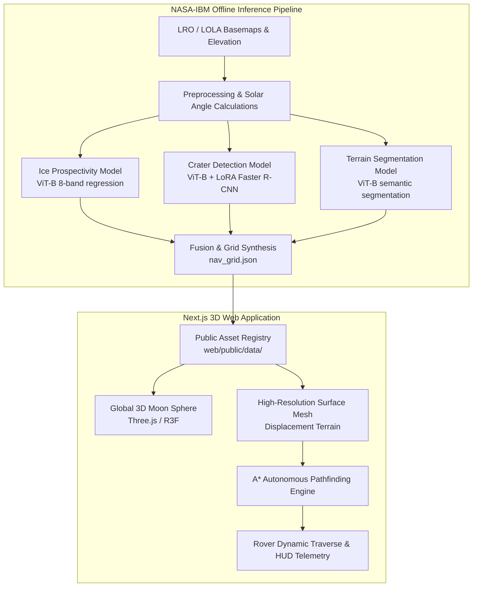

# 🌕 Drop the Rover — Interactive Lunar Navigation Simulation
### Powered by the NASA-IBM Lunar Foundation Model

[](https://nextjs.org/)
[](https://docs.pmnd.rs/react-three-fiber/)
[](https://python.org/)
[](https://opensource.org/licenses/MIT)

A **"Google Maps for the Moon"** experience where a user drops a rover from orbit onto an interactive, scientifically-textured 3D Moon. If the rover lands in an analyzed hotspot (such as the lunar South Pole / Shackleton crater area), it transitions to surface mode and autonomously plans optimal navigation trajectories toward ice deposits using real **NASA-IBM AI Foundation Model** outputs (ice prospectivity, crater hazard detection, and terrain segmentation).

---

## 🌟 Key Features

- **Orbital Drop to Surface Transition**: Free-fall animation from lunar orbit down to high-resolution surface elevation models. If outside an analyzed survey zone, mission control executes an autonomous trajectory recalculation arc to the nearest science hotspot.
- **Scientifically Grounded AI Data**:
  - **Water-Ice Prospectivity**: Dense regression ViT predicting water-ice concentrations across the upper regolith meter.
  - **Crater Hazard Detection**: Faster R-CNN detection head trained on LROC NAC/WAC imagery, calibrated to the Robbins Lunar Crater Catalog benchmark.
  - **IMP Terrain Classification**: Semantic segmentation classifying regolith plains, rim ridges, blocky ejecta boulder fields, steep crater walls, and permanently shadowed regions.
- **Autonomous A\* Pathfinding**: Real-time path planning balancing hazard costs (crater rims, steep slopes, boulder obstacles) with volatile discovery rewards.
- **Interactive Multi-Layer HUD**: Live toggle between Natural Color, Ice Heatmaps, Crater Outlines, and Slope/Hazard classifications, accompanied by real-time distance and hazard telemetry.

---

## 🏗️ System Architecture



---

## 📁 Repository Structure

```text
lunar/
├── prd.md                    # Detailed Product Requirements Document
├── data.md                   # NASA / LFM data specifications & scientific citations
├── pipeline/                 # Offline Python ML data & model inference pipeline
│   ├── configs/              # Pipeline configuration files
│   ├── scripts/              # Step-by-step pipeline scripts
│   │   ├── 00_smoke_test.py
│   │   ├── 01_download_models.py
│   │   ├── 02_download_data.py
│   │   ├── 03_tile_and_preprocess.py
│   │   ├── 04_run_ice_model.py
│   │   ├── 05_run_crater_model.py
│   │   ├── 06_run_terrain_model.py
│   │   └── 07_fuse_and_export.py
│   ├── processed/            # Processed hotspot heatmaps and navigation grids
│   ├── raw/                  # Source elevation and texture basemaps
│   ├── weights/              # Model checkpoints (excluded from git)
│   └── requirements.txt      # Python dependencies (PyTorch, torchvision, etc.)
└── web/                      # Next.js 3D web application
    ├── public/               # Public assets and precomputed lunar data
    │   └── data/             # Hotspot basemaps, craters, and nav grids
    ├── src/
    │   ├── app/              # Next.js App Router (pages, layout, globals)
    │   ├── components/       # UI and 3D Canvas components
    │   │   ├── scene/        # Three.js / R3F scene, rover, terrain, camera
    │   │   └── hud/          # Telemetry overlays, minimap, controls
    │   ├── lib/              # State management (Zustand), pathfinding, loaders
    │   └── types/            # TypeScript interfaces & types
    ├── package.json
    └── tsconfig.json
```

---

## 🚀 Quickstart

### 1. Web Application

Prerequisites: **Node.js 18+**

```bash
# Navigate to web application directory
cd web

# Install dependencies
npm install

# Start local development server
npm run dev
```

Open [http://localhost:3000](http://localhost:3000) in your browser to experience the 3D lunar drop and rover navigation simulation.

---

### 2. ML Inference Pipeline (Optional / Advanced)

Prerequisites: **Python 3.10+** and a CUDA-capable GPU (recommended).

```bash
# Navigate to pipeline directory
cd pipeline

# Create and activate a virtual environment
python -m venv .venv
.\.venv\Scripts\Activate.ps1   # On Windows
# source .venv/bin/activate    # On Linux/macOS

# Install pipeline dependencies
pip install -r requirements.txt

# Run the inference and fusion scripts
python scripts/00_smoke_test.py
python scripts/02_download_data.py
python scripts/03_tile_and_preprocess.py
python scripts/04_run_ice_model.py
python scripts/05_run_crater_model.py
python scripts/06_run_terrain_model.py
python scripts/07_fuse_and_export.py
```

The fused navigation grids and processed textures will automatically synchronize to `web/public/data/hotspots/south_pole/`.

---

## 🔬 Scientific Data & Foundation Models

- **NASA Scientific Visualization Studio (SVS)**: Global elevation (LOLA) and LROC WAC photographic textures.
- **NASA-IBM Lunar Foundation Model**:
  - `Ice-Prospectivity-NASA-IBM-Lunar-Foundation-Model`: 8-band polar map stack regression.
  - `Crater-Detection-NASA-IBM-Lunar-Foundation-Model`: ViT-B with LoRA adaptation for crater landmark identification.
  - `IMP-Segmentation-NASA-IBM-Lunar-Foundation-Model`: Regolith and hazard terrain classification.

---

## 🛠️ Tech Stack

- **Frontend**: Next.js 16, React 19, Three.js, React Three Fiber (`@react-three/fiber`), `@react-three/drei`, Zustand, Framer Motion, Lucide Icons.
- **Backend / Pipeline**: Python 3.10+, PyTorch, Torchvision, NumPy, Pillow, OpenCV, SciPy.

---

## 📄 License

Distributed under the MIT License. See `LICENSE` for more information.
